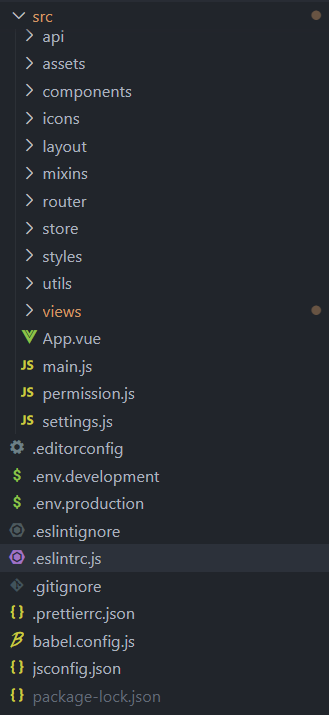
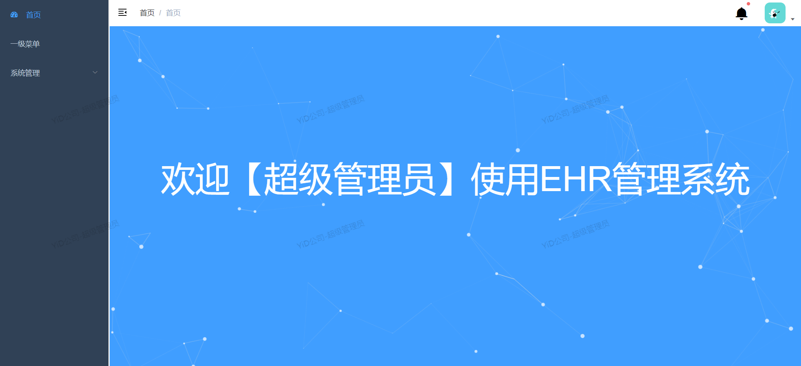
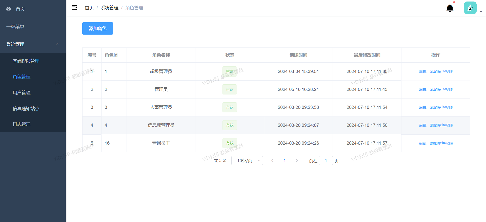

<h2>Yidu-platform-management</h2>

一个基于Vue+Element-UI搭建的轻量级（通用）后台管理系统模板，相比其他后台管理模板，集成的插件和封装功能比较少，简单，通俗易懂。

# 特性
前端：Vue+ELmentUI
后端：express+mysql
项目基本结构

### 使用说明

1,项目启动：npm run dev 或 yarn dev

2,项目打包：npm run build:prod

### 预览

账户信息：(管理员)账号：admin，密码：123456

